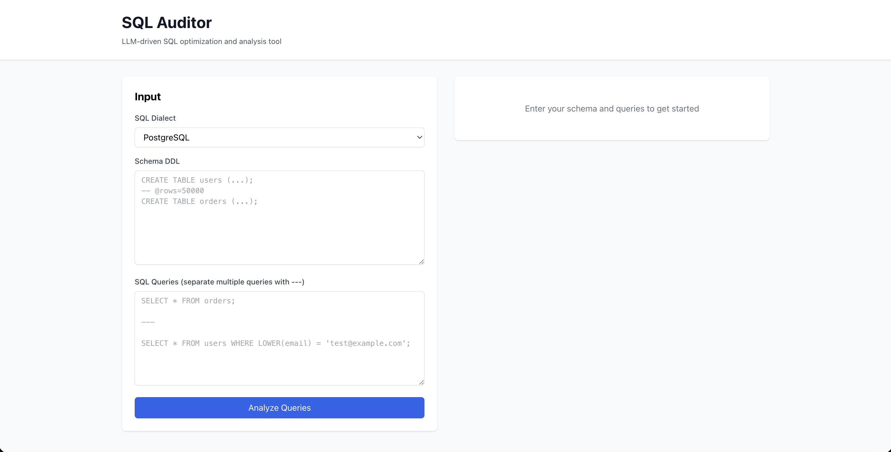

# SQL Auditor

[](https://www.python.org/)
[](https://fastapi.tiangolo.com/)
[](LICENSE)

**LLM-driven SQL optimization and analysis tool** for detecting performance issues, suggesting optimizations, and explaining query behavior.

## Screenshots



SQL Auditor provides an intuitive web interface for analyzing SQL queries, viewing detected issues, and receiving optimization recommendations.

## Features

- **Static Analysis**: Detects 10+ common SQL anti-patterns (SELECT *, unused joins, cartesian products, non-SARGable predicates, etc.)
- **LLM Integration**: Uses OpenAI GPT-4 to generate natural language explanations and optimized query rewrites
- **Index Advisor**: Recommends indexes based on query patterns (WHERE, JOIN, ORDER BY, GROUP BY)
- **Cost Estimation**: Heuristic-based cost scoring and improvement estimates
- **Web UI**: Clean React + TypeScript interface for interactive analysis
- **Jupyter Notebooks**: Prototyping and experimentation environment
- **Docker Support**: One-command deployment with docker-compose

## Architecture

```
┌─────────────┐
│   Frontend  │  React + TypeScript + Tailwind
│  (Port 5173)│
└──────┬──────┘
       │ HTTP
       ▼
┌─────────────┐
│   FastAPI   │  REST API
│  (Port 8000)│
└──────┬──────┘
       │
       ├──► Parser (SQLGlot)
       ├──► Rules Engine (10 rules)
       ├──► Cost Estimator
       ├──► Index Advisor
       └──► LLM Provider (OpenAI)
```

## Quick Start

### Prerequisites

- Python 3.11+
- Node.js 18+ (for frontend)
- Poetry (recommended) or pip
- SQLite3 (for demo database)
- OpenAI API key (optional, for LLM features)

### Installation

1. **Clone the repository**
   ```bash
   git clone <repo-url>
   cd llm-sql-auditor
   ```

2. **Set up environment**
   ```bash
   cp .env.example .env
   # Edit .env and add your OPENAI_API_KEY if desired
   ```

3. **Install Python dependencies**
   ```bash
   poetry install
   # OR
   pip install -r requirements.txt
   ```

4. **Seed demo database**
   ```bash
   ./scripts/seed_demo.sh
   ```

5. **Start development servers**
   ```bash
   ./scripts/dev_up.sh
   ```

   Or manually:
   ```bash
   # Terminal 1: Backend
   poetry run uvicorn backend.app:app --reload --port 8000

   # Terminal 2: Frontend
   cd frontend && npm install && npm run dev
   ```

6. **Access the application**
   - Frontend: Available on the configured port (default: 5173)
   - API: Available on the configured port (default: 8000)
   - API Docs: Available at `/docs` endpoint

### Docker

```bash
docker-compose up --build
```

## Usage

### Web UI

1. Open the frontend application in your browser
2. Paste your schema DDL in the "Schema" textarea
3. Enter SQL queries (separate multiple queries with `---`)
4. Select SQL dialect (PostgreSQL or SQLite)
5. Click "Analyze Queries"
6. Review issues, rewrites, index suggestions, and LLM explanations

### API

#### Audit Multiple Queries

```bash
curl -X POST <API_URL>/api/audit \
  -H "Content-Type: application/json" \
  -d '{
    "schema": "CREATE TABLE users (id INTEGER, email TEXT);",
    "queries": [
      "SELECT * FROM users;",
      "SELECT * FROM users WHERE LOWER(email) = '\''test@example.com'\'';"
    ],
    "dialect": "postgres"
  }'
```

#### Explain Single Query

```bash
curl -X POST <API_URL>/api/explain \
  -H "Content-Type: application/json" \
  -d '{
    "schema": "CREATE TABLE users (id INTEGER, email TEXT);",
    "query": "SELECT * FROM users WHERE LOWER(email) = '\''test@example.com'\'';",
    "dialect": "postgres"
  }'
```

### Jupyter Notebook

```bash
cd notebooks
jupyter notebook 01_prototype.ipynb
```

## Detected Issues

The rules engine detects the following issues:

| Code | Rule | Severity | Description | Example |
|------|------|----------|-------------|---------|
| R001 | SELECT_STAR | warn | Avoid SELECT * in production | `SELECT * FROM users;` |
| R002 | UNUSED_JOIN | warn | Joins where columns aren't referenced | `SELECT u.id FROM users u JOIN orders o ON ...` |
| R003 | CARTESIAN_JOIN | error | Joins without ON predicate | `SELECT * FROM users, orders;` |
| R004 | NON_SARGABLE | warn | Functions on indexed columns in WHERE | `WHERE LOWER(email) = 'test'` |
| R005 | MISSING_PREDICATE | warn | Large table scans without WHERE | `SELECT * FROM orders;` (100k+ rows) |
| R006 | ORDER_BY_NO_INDEX | info | ORDER BY columns lacking index | `ORDER BY created_at` (no index) |
| R007 | DISTINCT_MISUSE | info | DISTINCT as de-dupe band-aid | `SELECT DISTINCT ...` with joins |
| R008 | N_PLUS_ONE_PATTERN | warn | Correlated subqueries | `WHERE EXISTS (SELECT ... WHERE t.id = outer.id)` |
| R009 | LIKE_PREFIX_WILDCARD | warn | LIKE with leading wildcard | `WHERE name LIKE '%value'` |
| R010 | AGG_NO_GROUPING_INDEX | info | Aggregations missing covering index | `GROUP BY category` (no index) |

## Example Output

### Before & After Query Optimization

**Original Query:**
```sql
SELECT * FROM orders o
JOIN users u ON u.id = o.user_id
WHERE LOWER(u.email) = 'admin@example.com'
ORDER BY o.created_at DESC;
```

**Detected Issues:**
- R001: SELECT * usage
- R004: Non-SARGable predicate (LOWER function)
- R006: ORDER BY without supporting index

**Optimized Query:**
```sql
SELECT o.id, o.user_id, o.created_at, o.total_cents,
       u.id, u.email
FROM orders o
JOIN users u ON u.id = o.user_id
WHERE u.email = 'admin@example.com'  -- Removed LOWER()
ORDER BY o.created_at DESC;
```

**Recommended Index:**
```sql
CREATE INDEX idx_orders_user_created ON orders(user_id, created_at);
CREATE INDEX idx_users_email ON users(email);
```

### API Response Example

```json
{
  "summary": {
    "totalIssues": 5,
    "highSeverity": 1,
    "estImprovement": "2-4x potential speedup - Issues: Full scan on large table 'orders' (100000 rows), Non-SARGable function in WHERE clause"
  },
  "issues": [
    {
      "code": "R001",
      "severity": "warn",
      "message": "Avoid SELECT * in production queries...",
      "rule": "SELECT_STAR"
    }
  ],
  "rewrites": [
    {
      "original": "SELECT * FROM orders...",
      "optimized": "SELECT o.id, o.user_id FROM orders o...",
      "rationale": "Project only needed columns..."
    }
  ],
  "indexes": [
    {
      "table": "orders",
      "columns": ["user_id", "created_at"],
      "type": "btree",
      "rationale": "Supports ORDER BY and join"
    }
  ],
  "llmExplain": "Your query scans entire orders due to SELECT *..."
}
```

## Testing

```bash
# Run all tests
pytest

# Run with coverage
pytest --cov=backend --cov-report=html

# Run specific test file
pytest backend/tests/test_rules.py
```

## Project Structure

```
sql-auditor/
├── backend/
│   ├── app.py                 # FastAPI entry point
│   ├── core/
│   │   ├── config.py          # Configuration
│   │   ├── models.py          # Pydantic models
│   │   └── dialects.py        # SQL dialect handling
│   ├── services/
│   │   ├── analyzer/
│   │   │   ├── parser.py      # SQL parsing
│   │   │   ├── rules_engine.py # 10 detection rules
│   │   │   ├── cost_estimator.py
│   │   │   └── index_advisor.py
│   │   ├── llm/
│   │   │   ├── provider.py    # OpenAI integration
│   │   │   └── prompts.py     # LLM prompts
│   │   └── pipeline.py        # Main orchestration
│   ├── db/
│   │   ├── seed.sql           # Demo schema
│   │   └── explain_helpers.py
│   └── tests/                 # Test suite
├── frontend/
│   ├── src/
│   │   ├── App.tsx
│   │   ├── api.ts
│   │   └── components/
│   └── package.json
├── notebooks/
│   └── 01_prototype.ipynb
├── scripts/
│   ├── dev_up.sh
│   └── seed_demo.sh
├── docker-compose.yml
├── Dockerfile
└── README.md
```

## Configuration

Environment variables (see `.env.example`):

- `OPENAI_API_KEY`: OpenAI API key for LLM features (optional)
- `SQLAUDITOR_LOG_LEVEL`: Logging level (default: INFO)
- `SQLAUDITOR_DEMO_DB`: Path to demo SQLite database
- `DEFAULT_DIALECT`: Default SQL dialect (postgres/sqlite)

## Limitations

- **Heuristic-based**: Cost estimation and index recommendations are heuristic, not based on actual EXPLAIN plans
- **Static analysis only**: Does not execute queries or connect to live databases (unless using optional PG connection)
- **Limited dialect support**: Currently supports PostgreSQL and SQLite
- **LLM dependency**: Advanced explanations require OpenAI API key

## Roadmap

- [ ] Real EXPLAIN integration with live database connections
- [ ] Multi-dialect cost models (MySQL, SQL Server, etc.)
- [ ] Query library for storing and re-running analyses
- [ ] Export reports as JSON/Markdown from UI
- [ ] Batch processing for large query sets
- [ ] CI/CD integration hooks

## Contributing

Contributions welcome! Please:

1. Fork the repository
2. Create a feature branch
3. Add tests for new functionality
4. Ensure all tests pass and coverage ≥ 80%
5. Submit a pull request

## License

MIT License - see [LICENSE](LICENSE) file for details.

## Acknowledgments

- Built with [FastAPI](https://fastapi.tiangolo.com/)
- SQL parsing via [SQLGlot](https://github.com/tobymao/sqlglot)
- LLM integration via [OpenAI API](https://platform.openai.com/)

